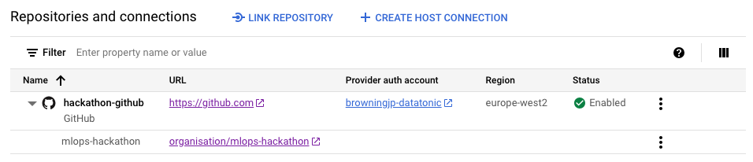
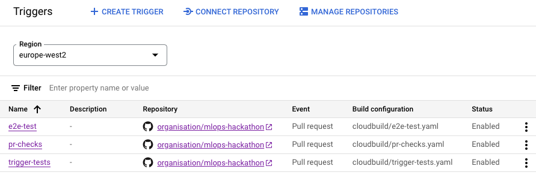
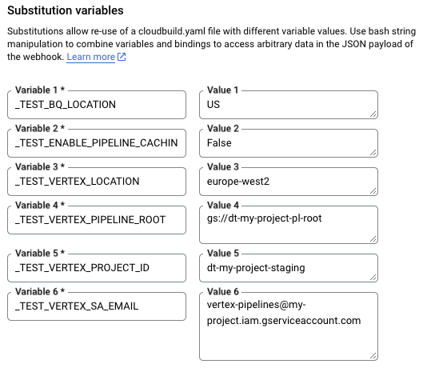

# MLOps Hackathon

*Learn about MLOps by deploying your own ML pipelines in Google Cloud. 
You'll solve a number of exercises and challenges to run pipelines in Vertex AI, continuously monitor your models, and promote your artifacts to a production environment.*

## Getting started 

As a hackathon attendee, simply follow this notebook series in your Vertex AI Workbench instance:

1. **[Health check](./hackathon/01_health_check.ipynb) - start here**
1. [Run pipelines](./hackathon/02_run_pipelines.ipynb)
1. [Promote model](./hackathon/03_promote_model.ipynb)
1. [Challenge: Model monitoring](./hackathon/04_monitoring_challenge.ipynb)
1. [Challenge: Real-time predictions](./hackathon/05_realtime_challenge.ipynb)

**❗Note:** This workshop has been designed to be run in Vertex AI Workbench. 
Support for running the workshop locally is provided, but we recommend Vertex AI Workbench for the best experience.

## For instructors


The notebooks are self-contained but instructors of this hackathon are asked to prepare the following for hackathon attendees.

### Deploy projects

1. Create 3x Google Cloud projects (dev, test, prod)
1. Use `make deploy` to deploy resources in each of them. Checkout for the workflow [infrastructure setup notebook](./docs/notebooks/01_infrastructure_setup.ipynb).
   ```bash
   # ensure env.sh references dev project
   make deploy env=dev
   # ensure env.sh references test project
   make deploy env=test
   # ensure env.sh references prod project
   make deploy env=prod
   ```
   
### Configure dev project

1. Update `terraform/users.tfvars`
2. Ensure `env.sh` references the dev project and run `make deploy env=dev`

### Configure test project

1. Add each user with their Google account with the following `Viewer` role
1. Create Cloud Build repo:
   
   **Note:** You might need to enable the Secret Manager API.
1. Create Cloud Build Service Account with IAM roles:
    - Artifact Registry Writer
    - Logs Writer
    - Storage Admin
    - Vertex AI User
    - Grant role "Service Account User" for this SA on `vertex-pipelines@mz-project.iam.gserviceaccount.com`
1. Create 3x Cloud Build triggers. For each use the settings below and reference the corresponding `cloudbuild/<trigger>.yaml` file:
   
    - Event: Pull Request
    - Source: 
      - Repository: 2nd gen
      - Base branch: `^develop$`
    - Comment control: Required
    - Configuration:
      - Type: Cloud Build configuration file
      - Location: Repository
      - Cloud Build configuration file: `/cloudbuild/<trigger-name>.yaml` 
    - Advanced:
      - Service account: `cloud-build@my-project-staging.iam.gserviceaccount.com`

   **Note:** Trigger `e2e-tests` requires the following substitution variables:
   

### Configure prod project

1. Add each user with their Google account with the following `Viewer` role
1. Create Cloud Build repo:
   
1. Create 1x Cloud Build trigger:
    - Event: Push new tag
    - Source: 
      - Repository: 2nd gen
      - Base branch: `.*`
    - Configuration:
      - Type: Cloud Build configuration file
      - Location: Repository
      - Cloud Build configuration file: `/cloudbuild/release.yaml` 
    - Advanced:
      - Service account: `cloud-build@my-project-staging.iam.gserviceaccount.com`
1. Create Cloud Build Service Account with IAM roles:
    - Artifact Registry Writer
    - Logs Writer
    - Storage Admin
    - Vertex AI User

### Clean up

1. Shutdown Workbench instances at the end of the day
1. Delete user branches in this repo
1. Delete user tags in this repo
1. Delete 3x projects
